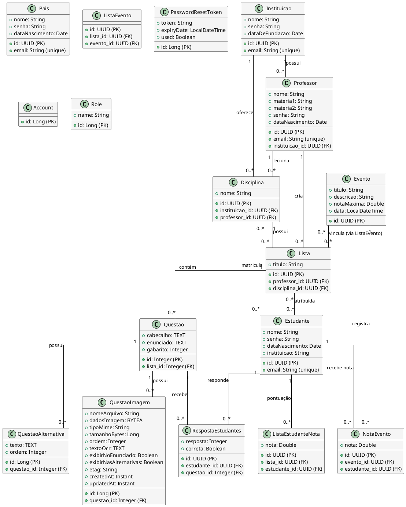

# Diagrama de Entidades - Sistema NotEasy

Este documento apresenta o modelo de entidades do sistema NotEasy, incluindo relacionamentos, atributos principais e diagramas visuais.

---

## Diagrama ER (PlantUML)



---

## Diagrama simplificado (ASCII)

```
┌──────────────┐
│ Instituicao  │
└──────┬───────┘
       │
       ├──────────────┐
       │              │
┌──────▼───────┐ ┌────▼──────┐
│  Professor   │ │ Disciplina│
└──────┬───────┘ └────┬──────┘
       │              │
       │         ┌────┼─────┐
       │         │    │     │
       │         │    │  N:N│
       │         │    │ ┌───▼──────┐
       │         │    │ │ Estudante│
       │         │    │ └──────────┘
       │         │ 1:N│
┌──────▼─────────▼────┘
│      Lista          │
└──────┬──────────────┘
       │ 1:N
┌──────▼───────┐
│   Questao    │
└──────┬───────┘
       │
       ├─────────────────┬──────────────────┐
       │                 │                  │
┌──────▼──────────┐ ┌────▼─────────┐ ┌─────▼──────────┐
│QuestaoAlternativa│ │QuestaoImagem│ │RespostaEstudante│
└─────────────────┘ └──────────────┘ └────────────────┘


       ┌────────┐
       │ Evento │
       └───┬────┘
           │
    ┌──────┴──────┐
    │             │
┌───▼────────┐ ┌──▼────────┐
│ListaEvento │ │NotaEvento │
└────────────┘ └───────────┘
```

---

## Entidades detalhadas

### 1. **Usuário e Autenticação**

#### Professor (implements UserDetails)
- Leciona disciplinas e cria listas de questões
- FK: instituicao_id
- Relacionamentos:
  - 1:N com Lista
  - 1:N com Disciplina

#### Estudante (implements UserDetails)
- Resolve questões e recebe notas
- Relacionamentos N:N:
  - Disciplina (matricula)
  - Lista (atribuída)
- Relacionamentos 1:N:
  - RespostaEstudantes
  - NotaEvento
  - ListaEstudanteNota

#### Instituicao (implements UserDetails)
- Entidade organizacional principal
- Relacionamentos 1:N:
  - Professor
  - Disciplina

#### Pais
- Responsável por estudante
- Campos: id, nome, email, senha, dataNascimento

---

### 2. **Conteúdo Acadêmico**

#### Disciplina
- Matéria lecionada por professor em instituição
- FK: instituicao_id, professor_id
- Relacionamentos:
  - N:N com Estudante (matriculados)

#### Lista
- Conjunto de questões criado por professor vinculado a uma disciplina
- FK: professor_id, disciplina_id
- Relacionamentos:
  - N:1 com Professor (criador)
  - N:1 com Disciplina (contexto acadêmico)
  - 1:N com Questao (contém)
  - N:N com Estudante (atribuídas via `lista_estudantes`)
  - N:N com Evento (vinculadas via `ListaEvento`)

#### Questao
- Pergunta com alternativas e imagens
- FK: lista_id
- Campos principais:
  - cabecalho (TEXT)
  - enunciado (TEXT, NOT NULL)
  - gabarito (Integer - índice da alternativa correta)
- Relacionamentos 1:N:
  - QuestaoAlternativa (cascade ALL, orphanRemoval)
  - QuestaoImagem (cascade ALL, orphanRemoval)
  - RespostaEstudantes

#### QuestaoAlternativa
- Opção de resposta (a, b, c, d...)
- FK: questao_id
- Campos: texto (TEXT), ordem (Integer)

#### QuestaoImagem
- Imagem associada à questão (armazenada como BLOB)
- FK: questao_id
- Campos principais:
  - **dadosImagem**: BYTEA (dados binários)
  - nomeArquivo: String
  - tipoMime: String (image/png, image/jpeg...)
  - tamanhoBytes: Long
  - textoOcr: TEXT (texto extraído por OCR)
  - ordem: Integer
  - exibirNoEnunciado: Boolean (default: true)
  - exibirNasAlternativas: Boolean (default: false)
  - etag: String (cache control)
  - createdAt, updatedAt: Instant

---

### 3. **Eventos e Avaliações**

#### Evento
- Prova, simulado ou atividade avaliativa
- Campos: titulo, descricao, notaMaxima, data
- Relacionamentos:
  - N:N com Lista (via ListaEvento)
  - 1:N com NotaEvento

#### ListaEvento
- Tabela de junção entre Lista e Evento
- FK: lista_id, evento_id

#### NotaEvento
- Nota do estudante em um evento
- FK: evento_id, estudante_id
- Campo: nota (Double)

#### ListaEstudanteNota
- Pontuação do estudante em uma lista
- FK: lista_id, estudante_id
- Campo: nota (Double)

#### RespostaEstudantes
- Resposta individual de estudante a uma questão
- FK: estudante_id, questao_id
- Campos: resposta (Integer - índice escolhido), correta (Boolean)

---

### 4. **Auxiliares**

#### PasswordResetToken
- Token para recuperação de senha
- Campos: token, expiryDate, used

#### Account
- Entidade auxiliar (uso genérico)

#### Role
- Papéis/permissões do sistema
- Campo: name (String)

---

## Relacionamentos principais

| Tipo | Origem | Destino | Descrição |
|------|--------|---------|-----------|
| 1:N | Instituicao | Professor | Uma instituição possui vários professores |
| 1:N | Instituicao | Disciplina | Uma instituição oferece várias disciplinas |
| 1:N | Professor | Lista | Um professor cria várias listas |
| 1:N | Professor | Disciplina | Um professor leciona várias disciplinas |
| N:N | Disciplina | Estudante | Matrícula (via `disciplina_estudantes`) |
| 1:N | Disciplina | Lista | Uma disciplina possui várias listas |
| N:N | Lista | Estudante | Atribuição (via `lista_estudantes`) |
| 1:N | Lista | Questao | Uma lista contém várias questões |
| 1:N | Questao | QuestaoAlternativa | Uma questão tem várias alternativas |
| 1:N | Questao | QuestaoImagem | Uma questão pode ter várias imagens |
| 1:N | Questao | RespostaEstudantes | Uma questão recebe várias respostas |
| 1:N | Estudante | RespostaEstudantes | Um estudante responde várias questões |
| N:N | Evento | Lista | Vinculação (via `ListaEvento`) |
| 1:N | Evento | NotaEvento | Um evento gera várias notas |

---

## Índices e otimizações

### Questao
- `idx_questao_lista` em `lista_id`
- `idx_questao_gabarito` em `gabarito`
- Batch size 50 para alternativas

### QuestaoImagem
- Ordenação por campo `ordem` (ASC)
- Campo `etag` para cache HTTP
- Timestamps para controle de modificação

---

## Notas de implementação

### Armazenamento de imagens
- **Tipo**: BYTEA (PostgreSQL) mapeado para `byte[]` no Java
- **Anotação JPA**: `@Column(columnDefinition = "bytea")`
- **Servir ao front**: Endpoint dedicado com Content-Type correto e suporte a cache (ETag/304)

### Cascades e Órfãos
- QuestaoAlternativa e QuestaoImagem usam `cascade = CascadeType.ALL` e `orphanRemoval = true`
- Deletar questão remove automaticamente alternativas e imagens

### Lazy Loading
- Relacionamentos principais usam `FetchType.LAZY` para otimização
- `@JsonBackReference` e `@JsonIgnore` previnem loops de serialização

### UserDetails (Spring Security)
- Professor, Estudante e Instituicao implementam `UserDetails`
- Cada um retorna authority específica (ROLE_PROFESSOR, ROLE_ESTUDANTE, etc)

---

## Queries úteis (exemplos)

```sql
-- Buscar questões de uma lista com imagens
SELECT q.*, qi.nome_arquivo, qi.ordem 
FROM questao q 
LEFT JOIN questao_imagens qi ON qi.questao_id = q.id 
WHERE q.lista_id = ?
ORDER BY q.id, qi.ordem;

-- Contar respostas corretas de um estudante em uma lista
SELECT COUNT(*) 
FROM resposta_estudantes re
JOIN questao q ON q.id = re.questao_id
WHERE re.estudante_id = ? 
  AND q.lista_id = ? 
  AND re.correta = true;

-- Listar disciplinas de um estudante
SELECT d.* 
FROM disciplina d
JOIN disciplina_estudantes de ON de.disciplina_id = d.id
WHERE de.estudante_id = ?;
```

---

**Arquivo**: `docs/diagrama_entidades.md`  
**Última atualização**: 22 de Novembro de 2025  
**Sistema**: NotEasy - Plataforma de questões educacionais

---

## Resumo das Entidades

**Autenticação e Usuários**: Professor, Estudante, Instituicao, Pais (4 entidades com UserDetails)

**Conteúdo Acadêmico**: Disciplina, Lista, Questao, QuestaoAlternativa, QuestaoImagem (5 entidades)

**Eventos e Avaliações**: Evento, ListaEvento, RespostaEstudantes, NotaEvento, ListaEstudanteNota (5 entidades)

**Auxiliares**: PasswordResetToken, Account, Role (3 entidades)

**Total**: 17 entidades principais


