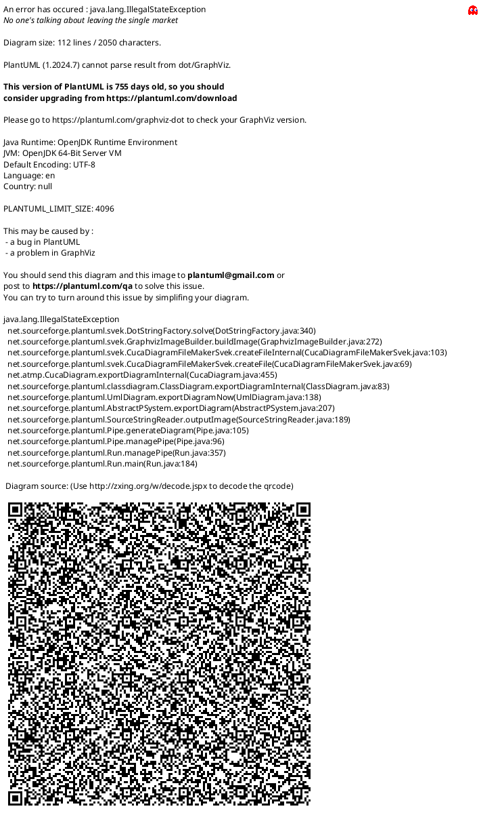

# Diagrama de Entidades Principais - Sistema NotEasy

Este documento apresenta apenas as entidades principais do sistema NotEasy com foco nos relacionamentos essenciais.

---

## Diagrama ER Simplificado (PlantUML)



---

## Diagrama simplificado (ASCII)

```
                    ┌──────────────┐
                    │ Instituicao  │
                    └──────┬───────┘
                           │
              ┌────────────┼────────────┐
              │                         │
       ┌──────▼───────┐          ┌─────▼──────┐
       │  Professor   │─────────►│ Disciplina │
       └──────┬───────┘          └─────┬──────┘
              │                        │
              │                   ┌────┼─────┐
              │                   │    │     │ N:N
              │                   │    │ ┌───▼──────┐
              │                   │    │ │ Estudante│
       ┌──────┼───────┐           │    │ └──────────┘
       │      │       │           │    │
   ┌───▼──┐ ┌▼─────┐ │      ┌────▼────▼┐
   │Lista │ │Evento│◄┼──────┤  N:N     │
   └───┬──┘ └──────┘ │      └──────────┘
       │ 1:N         │
   ┌───▼────────┐    │
   │  Questao   │    │
   └───┬────────┘    │
       │             │
   ┌───┼─────────────┼──────┐
   │   │             │      │
┌──▼──┐ ┌──▼──────┐ ┌▼──────────┐
│Alter│ │ Imagem  │ │  Resposta │
│nativ│ │         │ │ Estudantes│
└─────┘ └─────────┘ └───────────┘
```

---

## Descrição das Entidades Principais

### 🏢 Instituicao
Organização educacional que possui professores e oferece disciplinas.

### 👨‍🏫 Professor
Docente que leciona disciplinas e cria listas de questões.
- FK: `instituicao_id`

### 👨‍🎓 Estudante
Aluno que resolve questões e recebe avaliações.
- Relacionamento N:N com Disciplina (matrícula)
- Relacionamento N:N com Lista (atribuída)

### 📚 Disciplina
Matéria lecionada por um professor em uma instituição.
- FK: `instituicao_id`, `professor_id`

### 📋 Lista
Conjunto de questões criado por um professor no contexto de uma disciplina.
- FK: `professor_id`, `disciplina_id`
- Relacionamento N:1 com Professor (criador)
- Relacionamento N:1 com Disciplina (contexto acadêmico)

### ❓ Questao
Pergunta com enunciado, alternativas e imagens.
- FK: `lista_id`
- Campo `gabarito` indica o índice da resposta correta

### 📝 QuestaoAlternativa
Opções de resposta (a, b, c, d, e).
- FK: `questao_id`
- Campo `ordem` define a sequência (0=a, 1=b...)

### 🖼️ QuestaoImagem
Imagem armazenada como BLOB no banco.
- FK: `questao_id`
- Campo `dadosImagem` (BYTEA) contém os bytes da imagem
- Campo `textoOcr` armazena texto extraído por OCR

### ✅ RespostaEstudantes
Resposta de um estudante a uma questão.
- FK: `estudante_id`, `questao_id`
- Campo `correta` indica se acertou

### 📅 Evento
Prova, simulado ou atividade avaliativa vinculado a uma disciplina e criado por um professor.
- FK: `disciplina_id`, `professor_id`
- Relacionamento N:1 com Disciplina
- Relacionamento N:1 com Professor
- Relacionamento N:N com Lista (via ListaEvento)

---

## Fluxo Principal

```
1. Instituicao → cria → Professor
2. Professor → leciona → Disciplina
3. Estudante → matricula-se → Disciplina
4. Professor → cria → Lista (vinculada à Disciplina)
5. Lista → atribuída → Estudante
6. Lista → contém → Questao
7. Questao → possui → QuestaoAlternativa + QuestaoImagem
8. Estudante → responde → Questao (gera RespostaEstudantes)
9. Professor → cria → Evento (vinculado à Disciplina)
10. Evento → vincula → Lista (via ListaEvento)
```

---

## Relacionamentos Principais

| Origem | Relacionamento | Destino | Tipo |
|--------|---------------|---------|------|
| Instituicao | possui | Professor | 1:N |
| Instituicao | oferece | Disciplina | 1:N |
| Professor | cria | Lista | 1:N |
| Professor | leciona | Disciplina | 1:N |
| Professor | cria | Evento | 1:N |
| Disciplina | matricula | Estudante | N:N |
| Disciplina | possui | Evento | 1:N |
| Disciplina | possui | Lista | 1:N |
| Lista | atribuída | Estudante | N:N |
| Lista | contém | Questao | 1:N |
| Questao | possui | QuestaoAlternativa | 1:N |
| Questao | possui | QuestaoImagem | 1:N |
| Questao | recebe | RespostaEstudantes | 1:N |
| Estudante | responde | RespostaEstudantes | 1:N |
| Evento | vincula | Lista | N:N |

---

## Pontos-chave de Implementação

### 🔐 Autenticação
- Professor, Estudante e Instituicao implementam `UserDetails` (Spring Security)
- Cada um retorna authority específica (ROLE_PROFESSOR, ROLE_ESTUDANTE, etc)

### 💾 Armazenamento de Imagens
- Tipo: **BYTEA** (PostgreSQL) → `byte[]` (Java)
- Anotação: `@Column(columnDefinition = "bytea")`
- Servir ao front: endpoint dedicado com Content-Type correto + cache (ETag/304)

### 🗑️ Cascades
- QuestaoAlternativa e QuestaoImagem usam `cascade = CascadeType.ALL` e `orphanRemoval = true`
- Deletar questão remove automaticamente alternativas e imagens

### ⚡ Performance
- Relacionamentos usam `FetchType.LAZY`
- Índices em `lista_id` e `gabarito` na tabela Questao
- Batch size 50 para alternativas

---

**Arquivo**: `docs/diagrama_entidades_principais.md`  
**Data**: 22 de Novembro de 2025  
**Sistema**: NotEasy - Plataforma de questões educacionais

**Total de Entidades Principais**: 10

