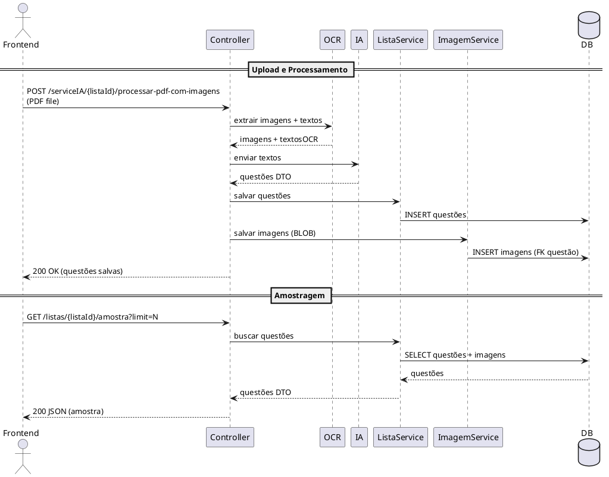

# Fluxo de identificação de questões (processamento de PDF com imagens -> amostragem para front)

Este documento descreve o fluxo de ponta a ponta desde a request para o endpoint `{listaId}/processar-pdf-com-imagens` até a amostragem das questões retornada ao front-end. Inclui o diagrama de sequência (PlantUML) e uma explicação passo-a-passo com os principais segmentos e endpoints.

---

## Diagrama de sequência (PlantUML)

Cole o bloco abaixo em um renderer PlantUML (plugin do VSCode, IntelliJ ou https://plantuml.com/pt/online) para visualizar o diagrama.

---

## Passo-a-passo resumido

1. **Upload**: Front envia POST com PDF para `/serviceIA/{listaId}/processar-pdf-com-imagens`
2. **OCR**: Serviço extrai imagens e textos do PDF
3. **IA**: Textos são enviados para IA que retorna questões estruturadas (DTOs)
4. **Persistência**: Questões são salvas no banco vinculadas à lista
5. **Imagens**: Imagens são salvas no banco como BLOB com FK para cada questão
6. **Amostragem**: Front solicita `GET /listas/{listaId}/amostra` e recebe as questões em JSON

---

## Endpoints e responsabilidades

- POST `/serviceIA/{listaId}/processar-pdf-com-imagens` — recebe PDF, coordena OCR/IA e persistência.
- GET `/listas/{listaId}/amostra` — retorna N questões amostradas para exibição no front.

## Observações / Boas práticas

- Persistir imagens no banco: usar coluna bytea (Postgres) e `@Lob` em entidade JPA; evitar colunas NOT NULL sem valores para linhas existentes — migração cuidadosa.
- Para servir imagens ao front, usar endpoint que escreve `Content-Type` correto e cache-control; suportar 304 Not Modified com ETag/Last-Modified.
- Guardar metadados (nomeArquivo, tipoMime, tamanhoBytes, textoOcr, ordem, exibirNoEnunciado) em tabela separada ligada por FK.
- Para grandes volumes, considerar uso de storage objeto + referências no DB ou compressão/streaming.

---

Arquivo criado: `docs/fluxo_identificacao_questoes.md`

